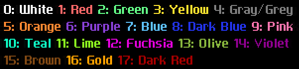

# Font Utilities
*also known as `font-utils`*

---
Adds in some new font colors for you to use in CrossCode! This adds in a total of 6 brand new font colors - as well as making one vanilla font color available for all character sets instead of just one! It also adds in a handy new text command to let you color fonts using color names rather than a bunch of IDs.

Colors offered: 

As for the named color codes:

| Color | Code |
|-|-|
| White | `\\C[white]` |
| Red | `\\C[red]` |
| Green | `\\C[green]` |
| Yellow | `\\C[yellow]` |
| Gray | `\\C[gray]` *or* `\\C[grey]` |
| Orange | `\\C[orange]` |
| Purple | `\\C[purple]` |
| Blue | `\\C[blue]` |
| Dark Blue | `\\C[dark-blue]` *or* `\\C[dark_blue]`|
| Pink | `\\C[pink]` |
| Teal | `\\C[teal]` |
| Lime | `\\C[lime]` |